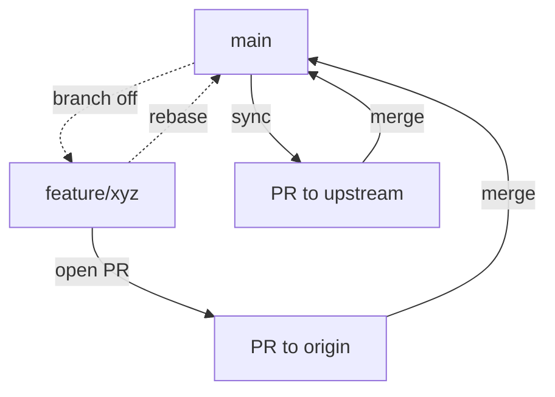
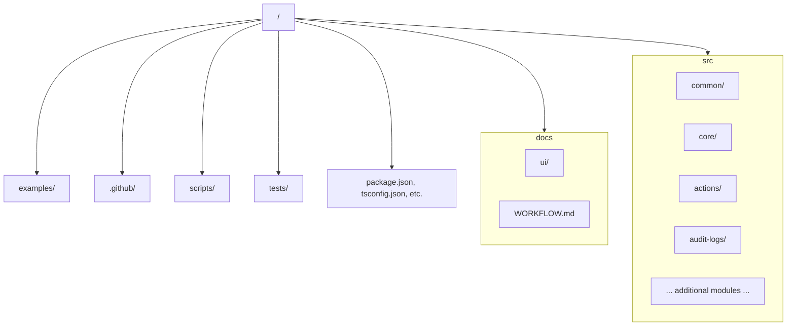

# Development Workflow & Project Structure

This is an *unofficial* fork of the WorkOS SDK for Deno & Fresh maintained by **Ryan Taylor** (@ryantaylor). All credits to the original WorkOS SDK by WorkOS (https://github.com/workos-inc/workos-node).

---

## 1. Fork-Sync Workflow
```mermaid
flowchart LR
  A[Local Repository] -->|push| B[origin (ryan-taylor/workos-jsr)]
  B -->|pull| A
  A -->|pull| C[upstream (workos-inc/workos-node)]
  C -->|merge| A
  click B "https://github.com/ryan-taylor/workos-jsr" "Open origin"
  click C "https://github.com/workos-inc/workos-node" "Open upstream"
```

## 2. Branching Model


## 3. Project Directory Structure
